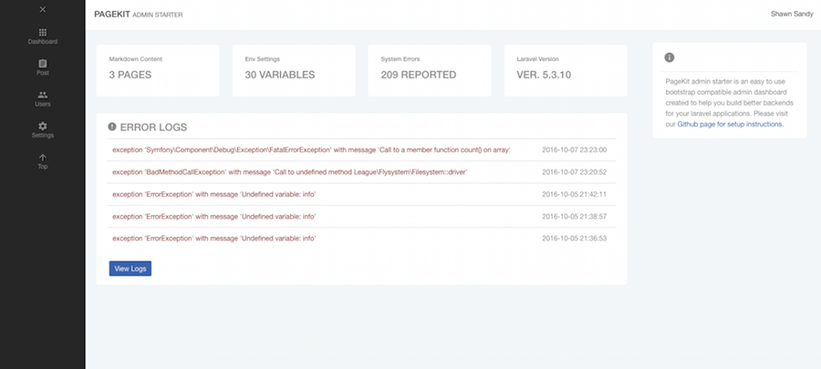
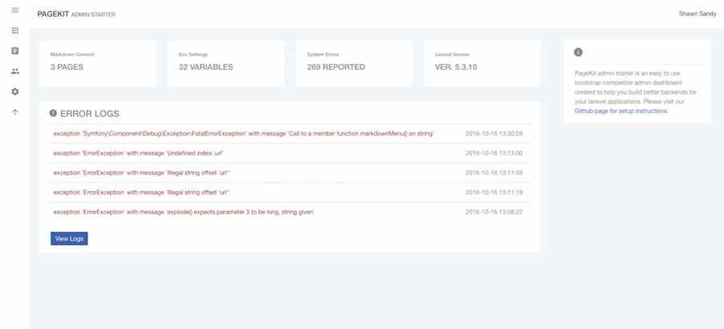

# Laravel UI.Pages (PageKit)

[](https://insight.sensiolabs.com/projects/2b15870b-8188-40ef-be16-96fea6a81bb9) [](https://www.codacy.com/app/shawnsandy04/ui-pages?utm_source=github.com&amp;utm_medium=referral&amp;utm_content=shawnsandy/ui-pages&amp;utm_campaign=Badge_Grade)

Pages (ui-pages) is a simple, easy to use drop in replacement UI for the default Laravel "Welcome Page". It provides a clean and modern set of bootstrap compatible starter pages -- Home, About, Contact and a starter admin/dashboard template. Along with a static flat file system for quickly adding and using markdown files as content. Setup, configuration and customization is quick and easy, allowing you to deploy and launch a Laravel based static marketing / promotional site in minutes so you can focus on the development. 

### Home Page Screen Shot


### Admin Dashboard (Black Haze)




#### Black Haze Lite



#### PageKit

> If you are looking for the original PageKit package you can still find it here at [Pagekit Original](https://github.com/shawnsandy/pagekit). I have moved PageKit to and new repository and changed the name to avoid conflict with PageKit CMS. I also used the opportunity to reboot versioning to better meet semver standards. Sorry for the inconvenience, I hope you find the package useful.

## Installation (traditional)

```

composer require shawnsandy/pagekit

```

__PageKitServiceProvider__

Add PageKitServiceProvider to the providers array in `config/app.php`

```php

    ShawnSandy\PageKit\PageKitServiceProvider::class

```

__Add the following (required) vendor service providers and aliases for pre-installed Laravel packages.__

Vendor Service providers 

```php

        Rap2hpoutre\LaravelLogViewer\LaravelLogViewerServiceProvider::class,
        JeroenG\Packager\PackagerServiceProvider::class,
        Sven\EnvProviders\EnvServiceProvider::class,
        Barryvdh\Debugbar\ServiceProvider::class,
        Brotzka\DotenvEditor\DotenvEditorServiceProvider::class,
        Laravel\Socialite\SocialiteServiceProvider::class,
        Vinkla\Shield\ShieldServiceProvider::class,
        
```
 
Vendor Aliases
 
```php

    'DotenvEditor' => Brotzka\DotenvEditor\DotenvEditorFacade::class,
    'Breadcrumbs' => ShawnSandy\PageKit\Facades\BreadcrumbFacade::class,
    'Socialite' => Laravel\Socialite\Facades\Socialite::class,
     
```
 
 Middleware
 
```php

    'shield' => \Vinkla\Shield\ShieldMiddleware::class,

```

__Publish the pagekit vendor files / assets__

```php

php artisan vendor:publish --provider="ShawnSandy\PageKit\PageKitServiceProvider"

```

__Publish tags__

You can publish individual pagekit tags using `--tags` option, *please note* that the `--pagekit-asssets` tag is required for page to display correctly. **BTW this is my preferred method of install**.

```php

php artisan vendor:publish --provider="ShawnSandy\PageKit\PageKitServiceProvider" --tag=name

```

or shortcut

```
php artisan vendor:publish --tag=name

```

**PageKit tags**

* `--tag=pagekit-assets` publishes your pagekit public assets / files to `/public/` 
* `--tag=pagekit-views` publishes your views to `vendor\pagekit`
* `--tag=pagekit-config` publishes `config\pagekit` to `config`

You can also use the `--force` to overwrite previously published files - `--tag=pagekit-assets --force`.

### Install for custom/package development 

To customize or use the package to start your own.

* Install [Laravel Packager](https://github.com/Jeroen-G/laravel-packager#laravel-packager) `composer require jeroen-g/laravel-packager`. Make sure to add the provider to your `config\app.php` provider array `JeroenG\Packager\PackagerServiceProvider::class,`.
* Import the repository `php artisan packager:git https://github.com/shawnsandy/pagekit YourVendorName YourPackgeName`. This will create and download the package to `/packages/YourVendorName/YourPackageName`. It will also add your package to composer autoload parameter and add it to `config/app.php` provider array.
* Customize and push to you repo
* Enjoy
          


## Usage

Once installed correctly you should be able to goto  `http://yoursite.app/pagekit` 

### Default index page

Replace the default *welcome* page with the PageKit index by modifying your `app/Http/route.php` 

```php
Route::get('/', function () {
    return view('welcome');
});
```
*to*

```php
  Route::get('', function(){
        return view('page::index');
    });
```

### Enable dashboard in login

Pages comes database free by default, as a result your admin Dash(board) won't require any login. However you can enable statless login using the [Laravel Shield](https://github.com/vinkla/laravel-shield) package that is bundled with Pages. 

Please insure the you have added the provider to your `config\app.php` (Vendor Providers).

```

Vinkla\Shield\ShieldServiceProvider::class,

```

Add the middleware to the $routeMiddleware array in your Kernel.php file.

```

'shield' => \Vinkla\Shield\ShieldMiddleware::class,

```

Publish the vendor assets using the provider tag. 

```

php artisan vendor:publish --provider="Vinkla\Shield\ShieldServiceProvider"

```

*Using `php artisan vendor:publish' can have some unintended affects* 


Run the php artisan command to generate your shield passwords `php artisan shield:hash username password`

Add the password to your '/config/shield.php' file

```

  'users' => [
        'main' => ['$2y$10$wBoPEW4WJO5kTlzwkF4vw.hfGnImJV2kla4UALPNKhMLEoYUWDFL6',
            '$2y$10$kk9u9VdzoXAh/hL/sy6BFuUP.Prf/761rbuPMVhCBaXsYKgymS232'],
    ],

```

Visit [Laravel Shield](https://github.com/vinkla/laravel-shield) for more info.

### Custom Branding

You can custom brand pagekit by editing the values in the `config/pagekit.php` 

Turn branding on:

```php
    'branding' => true,
``` 

Customize :

```php

'brand' => [
    'background-color' => '#FFFFFF',
    'header-background-color' => '#EEEEEE',
    'header-font-size' => '72px',
    'font-family' => '"Helvetica Neue", Helvetica, Arial, sans-serif',
    'header-font-color' => '#eee',
    'footer-background-color' => '#333333',
    'footer-color' => '#FFFFFF',
    'header-color' => '#EEEEEE',
    'text-color' => 'FFFFFF',
    'header-background-image' => "https://static.pexels.com/photos/129569/pexels-photo-129569-large.jpeg",
    'logo' => false
]

```

**Custom Header**

```php

header-background-image' => "https://static.pexels.com/photos/129569/pexels-photo-129569-large.jpeg",

```


## TODO

- [x] Contact form
- [ ] Social media links
- [ ] Add a static page editor
- [ ] Addon style selectors
- [ ] Custom artisan command

## Contributing

Fork it!
Create your feature branch: git checkout -b my-new-feature
Commit your changes: git commit -am 'Add some feature'
Push to the branch: git push origin my-new-feature
Submit a pull request :D
History

## Change Log

v.1.0.1

Renamed the package and mover the repository

[Pagekit Changelog](CHANGELOG.md)

## License

TODO: Modify [licence.md](LICENCE.md)


This project is licensed under the MIT License - see the [LICENSE.md](LICENSE.md) file for details
